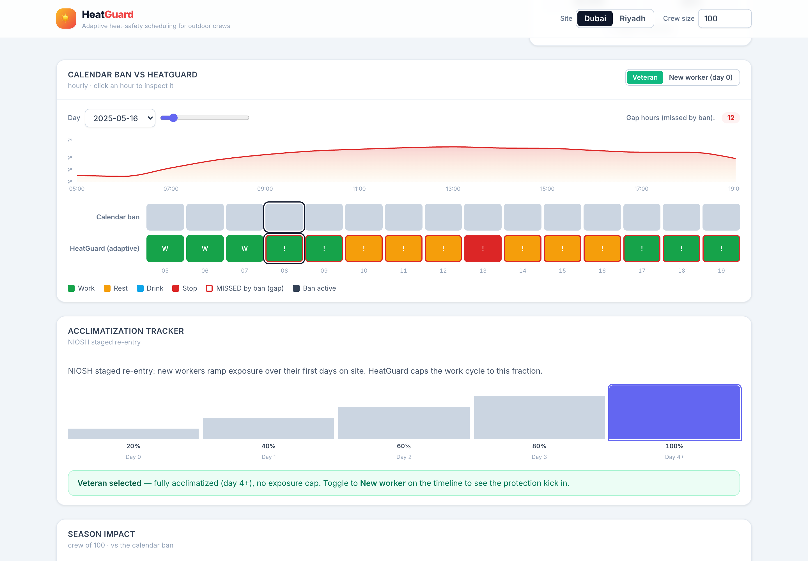
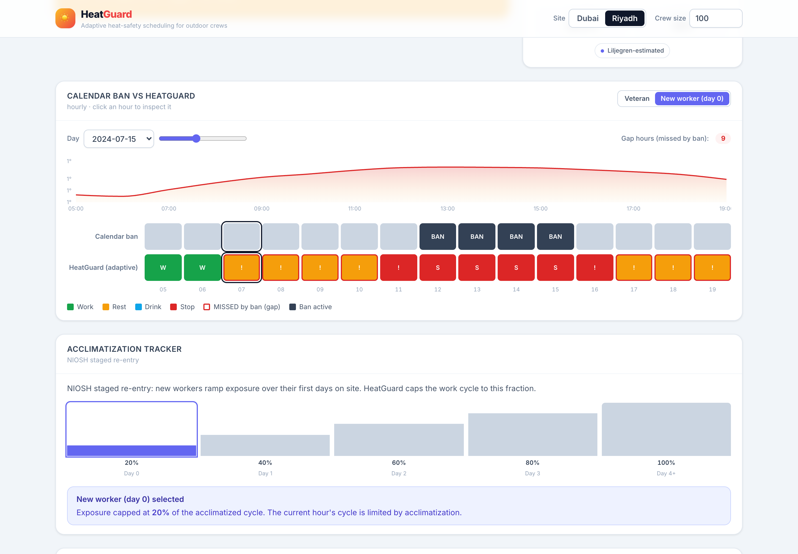

# HeatGuard 🌡️
[](https://github.com/fcistud/heatguard/actions/workflows/ci.yml)

**An adaptive, WBGT-driven work–rest–hydration scheduler that replaces the Gulf's blunt calendar-based midday work ban with a condition-responsive, standards-based, and *provable* heat-safety system for outdoor labour crews.**

### 🌐 Live Demos
* **Landing Page:** [HeatGuard Marketing Site](https://heatguard-psv77gylf-mariamihabmo-3393s-projects.vercel.app/)
* **Live Product Dashboard:** [Interactive Demo App](https://heatguard-5ysoalxi5q-uc.a.run.app/dashboard/)
* **Project Documentation:** [HeatGuard Docs](https://heatguard-6vdkm4nrc-mariamihabmo-3393s-projects.vercel.app/index.html) 

---

## 📸 The Platform

HeatGuard takes live or replayed weather, computes the heat-stress index, and outputs the *actual* mandated work-rest cycle and hydration schedule for current conditions.

### Adaptive Timeline

*The system preemptively halts work on dangerous mornings missed by the calendar ban, and recovers safe working hours when it's cool.*

### Machine Learning Personal Risk Profiling

*A Gradient Boosting model dynamically maps age, weight, and comorbidities against WBGT, flagging high-risk workers for shade rest without stopping the entire site.*

---

## 🛠️ The Tech Stack

HeatGuard is built as one pure, deterministic **Python engine** deployed via a serverless **FastAPI** backend to a **Vite + React** frontend. 

1. **Datasets (ERA5 & Gulf Met):** Ingests live Gulf meteorology and ERA5 reanalysis data to compute historical and live conditions.
2. **Deterministic Core:** Uses the open-source `pythermalcomfort` library to implement the Liljegren algorithm for outdoor Wet-Bulb Globe Temperature (WBGT). It then runs the ACGIH TLV metabolic tables and ISO 7933 Predicted Heat Strain (PHS) model to calculate safe limits and hydration targets.
3. **AI Personalisation:** We trained a Gradient Boosting model (using `scikit-learn` in our offline pipeline) on synthetic physiological profiles. It sits *on top* of the deterministic engine to protect vulnerable individuals.
4. **GenAI Auditor:** A fully local TF-IDF Retrieval-Augmented Generation (RAG) system ingests GCC laws (like UAE Ministerial Resolution No. 44) to provide unassailable, zero-hallucination compliance audits.

---

## 🚀 Quick Start (Local Setup)

```bash
pip install -e . && pip install -r requirements.txt
pytest -q                 # full suite incl. API, policy RAG, and ML overlay
heatguard fetch-datasets  # cache weather + forecasts
heatguard fetch-demo      # cache the two demo archives
scripts/run_demo.sh       # API + dashboard in one command  →  http://localhost:5173
```

> 📖 **New here?** The [**Handbook**](docs/HANDBOOK.md) explains everything (plain-language + technical), with an FAQ and a detailed roadmap.

---

## 🏢 The Business Case & Innovation

Our core innovation isn't just the thermal physics: it's the **Compliance Shield**. 

By enforcing strict Work-Rest-Shade (WRS) protocols, we ground our impact in the La Isla Network 'Adelante Initiative', which proved a **94% reduction in Acute Kidney Injury** and a **10-20% increase in productivity**. HeatGuard generates a tamper-evident, cryptographic audit log that proves to inspectors and courts that a contractor's dynamic schedule exceeded international ACGIH safety standards—shielding them from massive negligence fines.

It is a Tier-1 intervention. No expensive wearables required on Day 1. It rides on a single site WBGT meter and a supervisor's phone.

---

*(See `docs/` for the complete technical breakdown, ROI calculation proofs, and architecture schemas.)*
