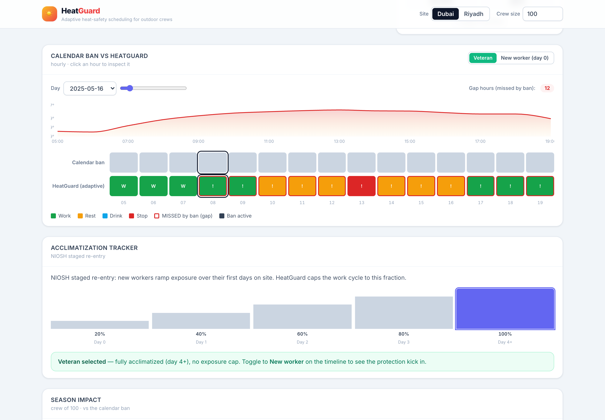
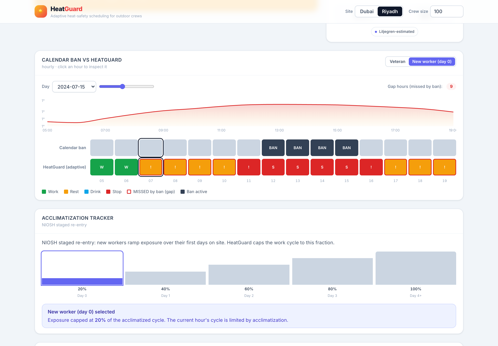

# HeatGuard 🌡️
[](https://github.com/fcistud/heatguard/actions/workflows/ci.yml)

**An adaptive, WBGT-driven work–rest–hydration scheduler that replaces the Gulf's blunt calendar-based midday work ban with a condition-responsive, standards-based, and *provable* heat-safety system for outdoor labour crews.**

### 🌐 Live Demos
* **Landing Page:** [HeatGuard Marketing Site](https://heatguard-psv77gylf-mariamihabmo-3393s-projects.vercel.app/)
* **Live Product Dashboard:** [Interactive Demo App](https://heatguard-5ysoalxi5q-uc.a.run.app/dashboard/)
* **Project Documentation:** [HeatGuard Docs](https://heatguard-6vdkm4nrc-mariamihabmo-3393s-projects.vercel.app/index.html) 

---

## 📸 The Platform

HeatGuard takes live or replayed weather, computes the heat-stress index, and outputs the *actual* mandated work-rest cycle and hydration schedule for current conditions.

### Adaptive Timeline

*The system preemptively halts work on dangerous mornings missed by the calendar ban, and recovers safe working hours when it's cool.*

### Machine Learning Personal Risk Profiling

*A Gradient Boosting model dynamically maps age, weight, and comorbidities against WBGT, flagging high-risk workers for shade rest without stopping the entire site.*

---

## 🛠️ The Tech Stack

HeatGuard is built as one pure, deterministic **Python engine** deployed via a serverless **FastAPI** backend to a **Vite + React** frontend. 

1. **Datasets (Open-Meteo):** Fetches **Open-Meteo** archive and forecast APIs (ERA5-class reanalysis + hourly forecast). Committed caches under `data/cache/` keep demos offline; swappable for direct ERA5/CDS or a national met feed later.
2. **Deterministic Core:** Outdoor WBGT uses the **Liljegren** model via `thermofeel` (Stull wet-bulb fallback at night). **ISO 7933 PHS** and hydration limits run through `pythermalcomfort`; ACGIH TLV metabolic tables and the NIOSH acclimatization ramp are in code.
3. **AI Personalisation:** A Gradient Boosting classifier (`scikit-learn`, offline) trains on **real cached Gulf weather** with **PHS-derived labels** over a grid of representative worker profiles. It sits *on top* of the deterministic engine and never overrides the regulatory signal.
4. **Compliance Auditor:** A fully local TF-IDF retrieval-and-extraction system indexes GCC laws (like UAE Ministerial Resolution No. 44) and returns cited excerpts directly from the committed corpus (no LLM generation).

> **Legal precedence:** HeatGuard never instructs work during active calendar or condition-based bans. See [`docs/SCOPE_GUARDRAIL.md`](docs/SCOPE_GUARDRAIL.md).

---

## 🚀 Quick Start (Local Setup)

```bash
# Python 3.12 + uv (authoritative lock).
uv sync --frozen --extra api --extra ml --extra dev
# Or: pip install -r requirements.txt && pip install -e ".[api,ml,dev]"
pytest -q                 # full suite incl. API, policy retrieval, and ML overlay
heatguard fetch-datasets  # cache weather + forecasts
heatguard fetch-demo      # cache the two demo archives
# Dashboard needs Node 24 / npm 11 (see web/package.json engines)
scripts/run_demo.sh       # API + dashboard in one command  →  http://localhost:5173
```

### Deck & validation notebook (optional extras)

```bash
uv sync --frozen --extra deck --extra notebook
python scripts/build_deck.py --dry-run
python notebooks/build_validation_notebook.py --output /tmp/heatguard_validation.ipynb
```

> 📖 **New here?** The [**Handbook**](docs/HANDBOOK.md) explains everything (plain-language + technical), with an FAQ and a detailed roadmap.

---

## 🏢 The Business Case & Innovation

Our core innovation isn't just the thermal physics: it's the **Compliance Shield**. 

By enforcing strict Work-Rest-Shade (WRS) protocols, we ground our impact in the La Isla Network 'Adelante Initiative', which proved a **94% reduction in Acute Kidney Injury** and a **10-20% increase in productivity**. HeatGuard generates a tamper-evident, cryptographic audit log that proves to inspectors and courts that a contractor's dynamic schedule exceeded international ACGIH safety standards—shielding them from massive negligence fines.

It is a Tier-1 intervention. No expensive wearables required on Day 1. It rides on a single site WBGT meter and a supervisor's phone.

---

*(See `docs/` for the complete technical breakdown, ROI calculation proofs, and architecture schemas.)*
